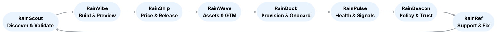
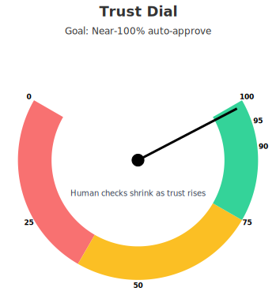

# RainStorm

**Agentic venture factory** that goes from **demand signal → deployed software** with minimal human intervention.

RainStorm (formerly “Alphorge”) orchestrates a suite of focused apps — the **Rain‑suite** — to validate ideas, build product, price & ship safely, launch GTM, onboard customers, measure health, enforce trust, and support success.

---

## 🌱 How RainStorm Works 

- **RainStorm is the conductor.** It moves products through each Rain‑app step, knows when to hand off, and makes sure rules and trust checks are applied.  
- **Apps work in parallel.** One product can be in the “build” step while another is being marketed or onboarded.  
- **The loop never stops.** After launch, data and feedback flow back into RainScout to decide the next best product to build.  

### The RainStorm Cycle
1. **RainScout** tests a list of ideas with surveys, outreach, and signals. It ranks which ones have the most demand.  
2. **RainVibe** turns the winning idea into working code with tests and a preview.  
3. **RainShip** suggests safe pricing, writes the changelog, and manages releases.  
4. **RainWave** creates on‑brand assets, copy, and a campaign calendar.  
5. **RainDock** provisions accounts, issues keys, and guides users to first value.  
6. **RainPulse** measures usage, health scores, churn, and expansion signals.  
7. **RainBeacon** enforces policies, signs receipts, and reduces human checks over time.  
8. **RainRef** drafts support answers and performs safe fixes (like resending onboarding).  

Data from RainPulse and RainRef feed back into RainScout. That way, the **next idea** is chosen based on what worked, what sold best, and what problems or gaps remain in the market.

---

## The Rain‑suite

- **RainScout** — demand validation & discovery (signals, outreach, surveys, booked calls)  
- **RainVibe** — spec‑to‑repo code generation (patches, tests, previews)  
- **RainShip** — guardrailed pricing + reliable releases (changelog, canary, rollback, receipts)  
- **RainWave** — on‑brand assets, copy, campaign calendar & scheduling  
- **RainDock** — provisioning & onboarding (accounts, keys, checklists, activation receipts)  
- **RainPulse** — product telemetry, NPS, churn/expansion signals, playbooks  
- **RainBeacon** — policy receipts, risk scoring, trust ramp (reduce HITL safely)  
- **RainRef** — support & success referee (grounded answers + safe automated fixes)  

> RainStorm is the **conductor**: it runs the loop, applies policy gates, and persists state & traces across the apps.

---

## Circular Flow



---

## Flow Table

<!-- RainStorm Flow Table -->
<div style="font-size:12px; line-height:1.35; overflow-x:auto;">
<table>
  <thead>
    <tr>
      <th style="font-size:14px; font-weight:800; text-align:left; white-space:nowrap;">Step</th>
      <th style="font-size:14px; font-weight:800; text-align:left;">Software Used</th>
      <th style="font-size:14px; font-weight:800; text-align:left;">Data Source</th>
      <th style="font-size:14px; font-weight:800; text-align:left;">Description</th>
      <th style="font-size:14px; font-weight:800; text-align:left;">Tasks</th>
    </tr>
  </thead>
  <tbody>
    <tr>
      <td style="white-space:nowrap; font-weight:600;">Before building</td>
      <td style="white-space:normal;">RainScout, DuckDB, Pandas, forecasting models, outreach tools</td>
      <td style="white-space:normal;">HN, GitHub, G2, Reddit, Product Hunt, surveys, past telemetry</td>
      <td style="white-space:normal;">Collect demand signals and combine them with feedback from the last cycle.</td>
      <td style="white-space:normal;">Gather trends, score opportunities, run surveys, book calls, consent management.</td>
    </tr>
    <tr>
      <td style="white-space:nowrap; font-weight:600;">Ideas into software</td>
      <td style="white-space:normal;">RainVibe (codegen), FastAPI, React, Postgres, GitHub Actions, Docker</td>
      <td style="white-space:normal;">Spec from RainStorm, build requests, templates</td>
      <td style="white-space:normal;">Generate code, run tests, create preview environments.</td>
      <td style="white-space:normal;">Scaffold services, apply patches, run CI, verify security scans, deploy preview.</td>
    </tr>
    <tr>
      <td style="white-space:nowrap; font-weight:600;">Pricing and plans</td>
      <td style="white-space:normal;">RainShip pricing engine, OPA guardrails, experiment framework</td>
      <td style="white-space:normal;">Competitor data, past sales results, WTP survey data</td>
      <td style="white-space:normal;">Decide what to charge and how to package tiers safely.</td>
      <td style="white-space:normal;">Suggest tiers, run tests, enforce min/max margins, approve changes.</td>
    </tr>
    <tr>
      <td style="white-space:nowrap; font-weight:600;">Launch &amp; marketing</td>
      <td style="white-space:normal;">RainWave, SendGrid/LinkedIn APIs, brand tokens, landing page generator</td>
      <td style="white-space:normal;">Campaign engagement logs, SEO/social previews, asset templates</td>
      <td style="white-space:normal;">Promote product and create branded materials.</td>
      <td style="white-space:normal;">Generate copy, create images/logos, schedule campaigns, design landing pages.</td>
    </tr>
    <tr>
      <td style="white-space:nowrap; font-weight:600;">Sales &amp; delivery</td>
      <td style="white-space:normal;">RainDock (provisioning), CRM-lite, webhook system</td>
      <td style="white-space:normal;">Customer signup data, payment provider</td>
      <td style="white-space:normal;">Deliver accounts and keys to new users and track onboarding.</td>
      <td style="white-space:normal;">Provision accounts, generate keys, send onboarding, update CRM.</td>
    </tr>
    <tr>
      <td style="white-space:nowrap; font-weight:600;">After launch</td>
      <td style="white-space:normal;">RainPulse, OpenTelemetry, Prometheus/Grafana, survey tools (NPS)</td>
      <td style="white-space:normal;">Usage telemetry, NPS surveys, logs</td>
      <td style="white-space:normal;">Track performance and feedback after release.</td>
      <td style="white-space:normal;">Collect metrics, gather feedback, analyze churn/upsell, detect issues.</td>
    </tr>
    <tr>
      <td style="white-space:nowrap; font-weight:600;">Safety, trust &amp; approvals</td>
      <td style="white-space:normal;">RainBeacon, OPA, audit hash-chain, SBOM scanners, secrets checkers</td>
      <td style="white-space:normal;">Policy receipts, dependency scan data, compliance logs</td>
      <td style="white-space:normal;">Enforce rules and require human approvals where needed.</td>
      <td style="white-space:normal;">Record decisions, enforce outreach/privacy limits, check for risks, log audits.</td>
    </tr>
    <tr>
      <td style="white-space:nowrap; font-weight:600;">Learning &amp; automation</td>
      <td style="white-space:normal;">RainBeacon trust ramp, risk scoring models, reinforcement learning</td>
      <td style="white-space:normal;">Historical performance metrics, telemetry, audit outcomes</td>
      <td style="white-space:normal;">Improve automation over time and reduce human checks.</td>
      <td style="white-space:normal;">Score risks, adjust trust levels, retrain models, optimize policies.</td>
    </tr>
    <tr>
      <td style="white-space:nowrap; font-weight:600;">Housekeeping</td>
      <td style="white-space:normal;">Docs & reports pipelines, changelog generators, dashboards (React UI), S3</td>
      <td style="white-space:normal;">Build reports, flows, code commits</td>
      <td style="white-space:normal;">Keep everything organized and visible.</td>
      <td style="white-space:normal;">Update docs, generate diagrams, manage artifacts, refresh dashboards.</td>
    </tr>
  </tbody>
</table>
</div>

### QA Involvement by Trust Level

| **Level**        | **QA Checks per Cycle** | **Description** |
|------------------|--------------------------|-----------------|
| **T0 – Manual**  | All stages               | Human reviews every stage in the cycle. |
| **T1 – Assisted**| ~50% of stages           | AI reviews everything, human checks about half. |
| **T2 – Spot checks** | 1 stage              | AI auto-approves low-risk; human checks one selected stage. |
| **T3 – Autopilot** | 1 per cycle            | One human QA check for the entire cycle; AI handles the rest. |

### Trust Dial
<p align="center">
  
</p>

### Detailed QA Checks by Cycle Stage

| **Cycle Stage**            | **What QA Checks**                          | **Why It Matters** |
|-----------------------------|---------------------------------------------|--------------------|
| **Before building**         | Validate demand signals (not spam/noise); review outreach templates | Ensures RainStorm pursues real opportunities and outreach stays compliant. |
| **Idea → software**         | Review generated code patches; confirm test coverage; check security scan results | Prevents broken builds, ensures code quality, and avoids vulnerabilities. |
| **Pricing and plans**       | Approve tier definitions; confirm margin guardrails; review survey sample validity | Stops underpricing/overpricing and ensures compliance with pricing rules. |
| **Launch & marketing**      | Check generated copy and brand assets; verify outreach consent flags | Protects brand image and prevents spam/violation of consent policies. |
| **Sales & delivery**        | Confirm provisioning scripts; test onboarding flows; check key/credential generation | Ensures new users can actually start using the product without blockers. |
| **After launch**            | Spot-check telemetry dashboards; validate NPS/feedback collection methods | Makes sure usage, customer satisfaction, and issues are measured correctly. |
| **Safety & approvals**      | Approve release notes; verify audit chain entries; confirm compliance passes | Keeps an immutable log of major actions and enforces policy compliance. |
| **Learning & automation**   | Review risk scoring outputs; audit promotion/demotion logic | Ensures the trust ramp adjusts correctly and doesn’t skip safeguards. |
| **Housekeeping**            | Check docs, changelogs, and reports for accuracy | Keeps records trustworthy for future cycles and audits. |

---

## ✨ Core Value
- **Discover with evidence** (RainScout) → **Build fast** (RainVibe) → **Price & ship safely** (RainShip) → **Reach your market** (RainWave) → **Onboard to first value** (RainDock) → **Measure what matters** (RainPulse) → **Automate with proof** (RainBeacon) → **Support & resolve** (RainRef) → **loop**.

## 🏗 Architecture
- **Orchestration**: LangGraph (Python)  
- **Backend**: FastAPI services; Cursor/RainVibe for codegen patches  
- **Data**: DuckDB/Parquet (experiments/evals), Postgres (ops), S3 (artifacts)  
- **Governance**: OPA policy checks, signed append‑only audit chain  
- **Observability**: OpenTelemetry traces  
- **HITL gates**: Required for releases, price changes, scaled outreach

## 📂 Repo Layout
```text
RainStorm/
  README.md
  docs/
    one-pager.md
    engine-apis.md
    studio-ui.md
    flows.md
    arch-diagram.png
  engine/
    api/            # FastAPI endpoints
    graph/          # LangGraph nodes & orchestration
    policies/       # OPA/py governance checks
    builders/       # codegen templates
    evals/          # scenario packs + metrics
    audits/         # hash-chain utils
    tests/          # pytest
  studio/
    web/            # React/MUI dashboard (traces, pricing, CRM-lite)
  flows/            # *.flow.json (Langflow/Visio exports)
  reports/          # auto-generated eval & decision reports
```

## 🚀 Getting Started
1. **Run dev stack**
   ```bash
   make dev
   # or
   docker compose up
   ```
2. **Import a flow** from `flows/*.flow.json` and hit **Run Scenario** in Studio.  
3. **Build** via `POST /build/scaffold` (RainVibe); review patches; CI spins a preview URL.  
4. **Ship** via `POST /release/prepare` + HITL approval (RainShip); campaigns scheduled in RainWave; provisioning via RainDock.  

## 🔒 Safety & Audit
- Consent + throttles for outreach; price guardrails; SBOM & secrets scanning.  
- Append‑only signed receipts for releases, pricing changes, outreach at scale.  
- Full OpenTelemetry tracing across agents and decisions.

## 📖 Docs
- See `/docs/one-pager.md`, `/docs/engine-apis.md`, `/docs/studio-ui.md`, `/docs/flows.md`.

## 🧪 Minimal API Surface (examples)
- `/signals/search`, `/outreach/sequence` (RainScout)  
- `/build/scaffold`, `/build/patch` (RainVibe)  
- `/pricing/suggest`, `/release/prepare`, `/release/promote` (RainShip)  
- `/assets/generate`, `/campaign/plan` (RainWave)  
- `/provision`, `/activation/:id` (RainDock)  
- `/metrics/health`, `/signals/churn` (RainPulse)  
- `/policy/evaluate`, `/audit/evidence/:id` (RainBeacon)  
- `/support/answer`, `/action/execute` (RainRef)

## 🗺 Roadmap
- **30 Days** → Core loop wired in LangGraph + Studio UI MVP  
- **60 Days** → Consent flows, price guardrails, hash‑chain audit, health signals  
- **90 Days** → Full venture loop: **discover → build → ship → launch → onboard → measure → automate → support**

## 📜 License
MIT — for research, experimentation, and innovation.
