# RainStorm  

```mermaid

%%{init: {
  "theme":"base",
  "flowchart": { "curve": "basis" },
  "themeVariables": { "fontFamily": "Inter, Arial" }
}}%%
flowchart LR
  %% node styles (light fills, no borders, bold black text)
  classDef n1 fill:#c6e2ff,stroke-width:0,color:#000,font-weight:700;
  classDef n2 fill:#ffe4c4,stroke-width:0,color:#000,font-weight:700;
  classDef n3 fill:#e6e6fa,stroke-width:0,color:#000,font-weight:700;
  classDef n4 fill:#d1ffd1,stroke-width:0,color:#000,font-weight:700;
  classDef n5 fill:#ffd1d1,stroke-width:0,color:#000,font-weight:700;
  classDef n6 fill:#fffacd,stroke-width:0,color:#000,font-weight:700;
  classDef n7 fill:#e0ffff,stroke-width:0,color:#000,font-weight:700;
  classDef n8 fill:#f5deb3,stroke-width:0,color:#000,font-weight:700;
  classDef n9 fill:#f0e68c,stroke-width:0,color:#000,font-weight:700;

  %% stadium shapes = wide ovals
  A([Before building]):::n1 --> B([Turning the idea into software]):::n2 --> C([Pricing and plans]):::n3 --> D([Launch and marketing]):::n4 --> E([Sales and delivery]):::n5 --> F([After launch]):::n6 --> G([Safety, trust, and approvals]):::n7 --> H([Learning and automation]):::n8 --> I([Housekeeping]):::n9 --> A

  %% grey arrow styling
  linkStyle default stroke:#9aa0a6,stroke-width:2;

```





<!-- RainStorm Flow Table -->
<div style="font-size:12px; line-height:1.35; overflow-x:auto;">
<table>
  <thead>
    <tr>
      <th style="font-size:14px; font-weight:800; text-align:left; white-space:nowrap;">Step</th>
      <th style="font-size:14px; font-weight:800; text-align:left;">Software Used</th>
      <th style="font-size:14px; font-weight:800; text-align:left;">Data Source</th>
      <th style="font-size:14px; font-weight:800; text-align:left;">Description</th>
      <th style="font-size:14px; font-weight:800; text-align:left;">Tasks</th>
    </tr>
  </thead>
  <tbody>
    <tr>
      <td style="white-space:nowrap; font-weight:600;">Before building</td>
      <td style="white-space:normal;">DuckDB, Pandas, forecasting models, survey/outreach tools (Calendly, email APIs)</td>
      <td style="white-space:normal;">HN, GitHub, G2, surveys, customer calls, past telemetry</td>
      <td style="white-space:normal;">Collect demand signals and combine them with feedback from the last cycle.</td>
      <td style="white-space:normal;">Gather trends, score opportunities, run surveys, book calls, consent management.</td>
    </tr>
    <tr>
      <td style="white-space:nowrap; font-weight:600;">Ideas into software</td>
      <td style="white-space:normal;">RainVibe (codegen), FastAPI, React, Postgres, GitHub Actions, Docker</td>
      <td style="white-space:normal;">Spec from RainStorm, build requests, templates</td>
      <td style="white-space:normal;">Generate code, run tests, create preview environments.</td>
      <td style="white-space:normal;">Scaffold services, apply patches, run CI, verify security scans, deploy preview.</td>
    </tr>
    <tr>
      <td style="white-space:nowrap; font-weight:600;">Pricing and plans</td>
      <td style="white-space:normal;">Pricing engine, OPA for guardrails, experiment framework (feature flags, A/B test)</td>
      <td style="white-space:normal;">Competitor data, past sales results, WTP survey data</td>
      <td style="white-space:normal;">Decide what to charge and how to package tiers safely.</td>
      <td style="white-space:normal;">Suggest tiers, run tests, enforce min/max margins, approve changes.</td>
    </tr>
    <tr>
      <td style="white-space:nowrap; font-weight:600;">Launch &amp; marketing</td>
      <td style="white-space:normal;">Campaign automation (SendGrid, LinkedIn API), AI copy/image tools, landing page generator</td>
      <td style="white-space:normal;">Campaign engagement logs, SEO/social previews, asset templates</td>
      <td style="white-space:normal;">Promote product and create branded materials.</td>
      <td style="white-space:normal;">Generate copy, create images/logos, schedule campaigns, design landing pages.</td>
    </tr>
    <tr>
      <td style="white-space:nowrap; font-weight:600;">Sales &amp; delivery</td>
      <td style="white-space:normal;">CRM-lite (Postgres + API), provisioning pipeline, webhook system</td>
      <td style="white-space:normal;">Customer signup data, payment provider</td>
      <td style="white-space:normal;">Deliver accounts and keys to new users and track onboarding.</td>
      <td style="white-space:normal;">Provision accounts, generate keys, send onboarding, update CRM.</td>
    </tr>
    <tr>
      <td style="white-space:nowrap; font-weight:600;">After launch</td>
      <td style="white-space:normal;">OpenTelemetry, Prometheus/Grafana, survey tools (NPS), analytics (pgvector clustering)</td>
      <td style="white-space:normal;">Usage telemetry, NPS surveys, logs</td>
      <td style="white-space:normal;">Track performance and feedback after release.</td>
      <td style="white-space:normal;">Collect metrics, gather feedback, analyze churn/upsell, detect issues.</td>
    </tr>
    <tr>
      <td style="white-space:nowrap; font-weight:600;">Safety, trust &amp; approvals</td>
      <td style="white-space:normal;">OPA, audit hash-chain, SBOM scanners, secrets checkers</td>
      <td style="white-space:normal;">Policy receipts, dependency scan data, compliance logs</td>
      <td style="white-space:normal;">Enforce rules and require human approvals where needed.</td>
      <td style="white-space:normal;">Record decisions, enforce outreach/privacy limits, check for risks, log audits.</td>
    </tr>
    <tr>
      <td style="white-space:nowrap; font-weight:600;">Learning &amp; automation</td>
      <td style="white-space:normal;">Risk scoring models, auto-promotion/demotion logic, reinforcement learning</td>
      <td style="white-space:normal;">Historical performance metrics, telemetry, audit outcomes</td>
      <td style="white-space:normal;">Improve automation over time and reduce human checks.</td>
      <td style="white-space:normal;">Score risks, adjust trust levels, retrain models, optimize policies.</td>
    </tr>
    <tr>
      <td style="white-space:nowrap; font-weight:600;">Housekeeping</td>
      <td style="white-space:normal;">Auto-doc pipelines, changelog generators, dashboards (React UI), S3 for artifacts</td>
      <td style="white-space:normal;">Build reports, flows, code commits</td>
      <td style="white-space:normal;">Keep everything organized and visible.</td>
      <td style="white-space:normal;">Update docs, generate diagrams, manage artifacts, refresh dashboards.</td>
    </tr>
  </tbody>
</table>
</div>

### QA Involvement by Trust Level

| **Level**        | **QA Checks per Cycle** | **Description** |
|------------------|--------------------------|-----------------|
| **T0 – Manual**  | All stages               | Human reviews every stage in the cycle. |
| **T1 – Assisted**| ~50% of stages           | AI reviews everything, human checks about half. |
| **T2 – Spot checks** | 1 stage              | AI auto-approves low-risk; human checks one selected stage. |
| **T3 – Autopilot** | 1 per cycle            | One human QA check for the entire cycle; AI handles the rest. |

### Trust Dial
<p align="center">
  
</p>

### Detailed QA Checks by Cycle Stage

| **Cycle Stage**            | **What QA Checks**                          | **Why It Matters** |
|-----------------------------|---------------------------------------------|--------------------|
| **Before building**         | Validate demand signals (not spam/noise); review outreach templates | Ensures RainStorm pursues real opportunities and outreach stays compliant. |
| **Idea → software**         | Review generated code patches; confirm test coverage; check security scan results | Prevents broken builds, ensures code quality, and avoids vulnerabilities. |
| **Pricing and plans**       | Approve tier definitions; confirm margin guardrails; review survey sample validity | Stops underpricing/overpricing and ensures compliance with pricing rules. |
| **Launch & marketing**      | Check generated copy and brand assets; verify outreach consent flags | Protects brand image and prevents spam/violation of consent policies. |
| **Sales & delivery**        | Confirm provisioning scripts; test onboarding flows; check key/credential generation | Ensures new users can actually start using the product without blockers. |
| **After launch**            | Spot-check telemetry dashboards; validate NPS/feedback collection methods | Makes sure usage, customer satisfaction, and issues are measured correctly. |
| **Safety & approvals**      | Approve release notes; verify audit chain entries; confirm compliance passes | Keeps an immutable log of major actions and enforces policy compliance. |
| **Learning & automation**   | Review risk scoring outputs; audit promotion/demotion logic | Ensures the trust ramp adjusts correctly and doesn’t skip safeguards. |
| **Housekeeping**            | Check docs, changelogs, and reports for accuracy | Keeps records trustworthy for future cycles and audits. |


**Agentic venture factory** that goes from **demand signal → deployed software** with minimal human intervention.  

Agents assess market demand, validate with real outreach, auto-build repos (with tests), price/package, launch campaigns, and handle delivery + upsell — with just **one human QA/creative gate** before release. Every decision is logged, evaluated, and cryptographically signed.  

---

## ✨ Core Value  
RainStorm is the first end-to-end **agentic AI product foundry**:  

- **Demand Intelligence** → forecast signals with uncertainty  
- **Opportunity Ranking** → ROI, time-to-MVP, and market fit scoring  
- **Discovery & Outreach** → surveys, cadences, consent flows, call booking  
- **Product Builder** → Cursor-driven codegen patches (FastAPI, DB, LangGraph, React UI, tests, CI)  
- **Release Manager** → CI/CD, changelog, preview URL, HITL approval required  
- **Pricing & Packaging** → tiers, guardrails, WTP testing  
- **Marketing & Sales** → ETA-aware campaigns, assets, CRM integration  
- **Fulfillment & Success** → provisioning, onboarding, telemetry, NPS/upsell  

---

## 🏗 Architecture  

- **Front Door**: Ops console agent + React Studio UI  
- **Orchestration**: LangGraph (Python)  
- **Backend**: FastAPI services; Cursor for iterative codegen patches  
- **Data**: DuckDB/Parquet (experiments/evals), Postgres (ops), S3 (artifacts)  
- **Governance**: OPA/py policy checks, signed append-only audit chain  
- **Observability**: OpenTelemetry traces  
- **HITL gates**: Required for releases, price changes, scaled outreach  

---

## Branding Variants  

<table>
<tr>
<td align="center">
  <br/>
  <sub>Animated Text</sub>
</td>
<td align="center">
  <br/>
  <sub>Animated Icon</sub>
</td>
<td align="center">
  <br/>
  <sub>Icon + Text Animation</sub>
</td>
</tr>
</table>

---

## 📂 Repo Layout

```text

RainStorm/
  README.md
  docs/
    one-pager.md
    arch-diagram.png
  engine/
    api/            # FastAPI endpoints
    graph/          # LangGraph nodes & orchestration
    policies/       # OPA/py governance checks
    builders/       # codegen templates
    evals/          # scenario packs + metrics
    audits/         # hash-chain utils
    tests/          # pytest
  studio/
    web/            # React/MUI dashboard (traces, pricing, CRM-lite)
  flows/            # *.flow.json (Langflow/Visio exports)
  reports/          # auto-generated eval & decision reports
```

---

## 🚀 Getting Started  

1. Clone the repo and install dependencies.  
   ```bash
   make dev
   # or
   docker compose up

2. Import a flow from flows/*.flow.json and press Run Scenario.


3. Use POST /build/scaffold to generate a new service scaffold (CRUD + tests + CI + React admin).


4. Review Cursor patches → CI spins a preview URL.


5. Human QA approves release → Marketing & Pricing agents schedule launch → Fulfillment provisions accounts.


---

🔒 Safety & Audit

Outbound outreach uses consent + throttles.

Price guardrails, SBOM checks, and secrets scanning baked in.

Every decision (release, pricing, outreach) is anchored in an append-only signed hash chain.

Policy receipts and OpenTelemetry spans provide traceability across agents.


---

📖 Docs

One-pager

Studio UI

Engine APIs

Flows


---

🧪 API Surface

/opportunities/search → pull signals, forecast demand

/outreach/sequence → send survey / booking cadences

/build/scaffold → generate repo scaffold + tests

/build/patch → apply codegen diffs

/release/prepare → changelog + migrations (requires HITL)

/pricing/suggest → generate guardrailed tiers

/marketing/plan → campaign assets + ETA scheduling

/crm/provision → customer onboarding + telemetry

/trace/{id} → query signed trace

/metrics → demand / build / GTM metrics


---

🗺 Roadmap

30 Days → Core agents wired in LangGraph + Studio UI MVP

60 Days → Outreach consent flows, price guardrails, hash-chain audit

90 Days → Full venture loop: demand → build → launch → telemetry → upsell


---

📜 License

MIT – for research, experimentation, and innovation.
