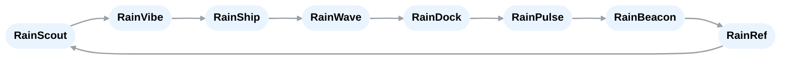

# RainStorm Flows

## Suite Loop

## Trust Ramp (levels)
- **T0:** all HITL
- **T1:** low‑risk auto; approvals for price/release/outreach
- **T2:** auto‑promote if canary green + scans clean; sample reviews
- **T3:** one QA check per loop; everything else by receipts

## Example Traces
- `discover → build → ship → wave → dock → pulse → beacon → ref → discover`

## Event Contract (shared)
All events include: `event`, `trace_id`, `causation_id`, `at`, `source`, optional `receipts[]`.
